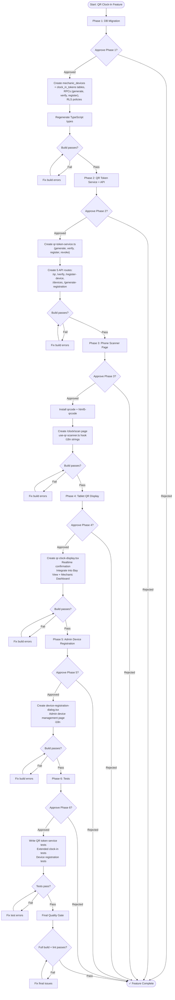

```mermaid
flowchart TD
    Start(["Start: QR Clock-In Feature"])
    
    %% Phase 1
    Phase1["Phase 1: DB Migration"]
    P1_Breakpoint{"Approve Phase 1?"}
    P1_Task["Create mechanic_devices + clock_in_tokens tables,
            RPCs (generate, verify, register),
            RLS policies"]
    P1_TypeGen["Regenerate TypeScript types"]
    P1_BuildCheck{"Build passes?"}
    P1_Fix["Fix build errors"]
    
    %% Phase 2
    Phase2["Phase 2: QR Token Service + API"]
    P2_Breakpoint{"Approve Phase 2?"}
    P2_Task["Create qr-token-service.ts
            (generate, verify, register, revoke)"]
    P2_Routes["Create 5 API routes:
            /qr, /verify, /register-device,
            /devices, /generate-registration"]
    P2_BuildCheck{"Build passes?"}
    P2_Fix["Fix build errors"]
    
    %% Phase 3
    Phase3["Phase 3: Phone Scanner Page"]
    P3_Breakpoint{"Approve Phase 3?"}
    P3_Install["Install qrcode + html5-qrcode"]
    P3_Task["Create /clock/scan page
            use-qr-scanner.ts hook
            i18n strings"]
    P3_BuildCheck{"Build passes?"}
    P3_Fix["Fix build errors"]
    
    %% Phase 4
    Phase4["Phase 4: Tablet QR Display"]
    P4_Breakpoint{"Approve Phase 4?"}
    P4_Task["Create qr-clock-display.tsx
            Realtime confirmation
            Integrate into Bay View + Mechanic Dashboard"]
    P4_BuildCheck{"Build passes?"}
    P4_Fix["Fix build errors"]
    
    %% Phase 5
    Phase5["Phase 5: Admin Device Registration"]
    P5_Breakpoint{"Approve Phase 5?"}
    P5_Task["Create device-registration-dialog.tsx
            Admin device management page
            i18n"]
    P5_BuildCheck{"Build passes?"}
    P5_Fix["Fix build errors"]
    
    %% Phase 6
    Phase6["Phase 6: Tests"]
    P6_Breakpoint{"Approve Phase 6?"}
    P6_Task["Write QR token service tests
            Extended clock-in tests
            Device registration tests"]
    P6_TestRun{"Tests pass?"}
    P6_Fix["Fix test errors"]
    
    %% Final quality gate
    FinalGate["Final Quality Gate"]
    FinalBuild{"Full build + lint passes?"}
    FinalFix["Fix final issues"]
    
    End(["✓ Feature Complete"])
    
    %% Flow
    Start --> Phase1 --> P1_Breakpoint
    P1_Breakpoint -->|Approved| P1_Task --> P1_TypeGen --> P1_BuildCheck
    P1_Breakpoint -->|Rejected| End
    P1_BuildCheck -->|Pass| Phase2
    P1_BuildCheck -->|Fail| P1_Fix --> P1_BuildCheck
    
    Phase2 --> P2_Breakpoint
    P2_Breakpoint -->|Approved| P2_Task --> P2_Routes --> P2_BuildCheck
    P2_Breakpoint -->|Rejected| End
    P2_BuildCheck -->|Pass| Phase3
    P2_BuildCheck -->|Fail| P2_Fix --> P2_BuildCheck
    
    Phase3 --> P3_Breakpoint
    P3_Breakpoint -->|Approved| P3_Install --> P3_Task --> P3_BuildCheck
    P3_Breakpoint -->|Rejected| End
    P3_BuildCheck -->|Pass| Phase4
    P3_BuildCheck -->|Fail| P3_Fix --> P3_BuildCheck
    
    Phase4 --> P4_Breakpoint
    P4_Breakpoint -->|Approved| P4_Task --> P4_BuildCheck
    P4_Breakpoint -->|Rejected| End
    P4_BuildCheck -->|Pass| Phase5
    P4_BuildCheck -->|Fail| P4_Fix --> P4_BuildCheck
    
    Phase5 --> P5_Breakpoint
    P5_Breakpoint -->|Approved| P5_Task --> P5_BuildCheck
    P5_Breakpoint -->|Rejected| End
    P5_BuildCheck -->|Pass| Phase6
    P5_BuildCheck -->|Fail| P5_Fix --> P5_BuildCheck
    
    Phase6 --> P6_Breakpoint
    P6_Breakpoint -->|Approved| P6_Task --> P6_TestRun
    P6_Breakpoint -->|Rejected| End
    P6_TestRun -->|Pass| FinalGate
    P6_TestRun -->|Fail| P6_Fix --> P6_TestRun
    
    FinalGate --> FinalBuild
    FinalBuild -->|Pass| End
    FinalBuild -->|Fail| FinalFix --> FinalBuild
```
