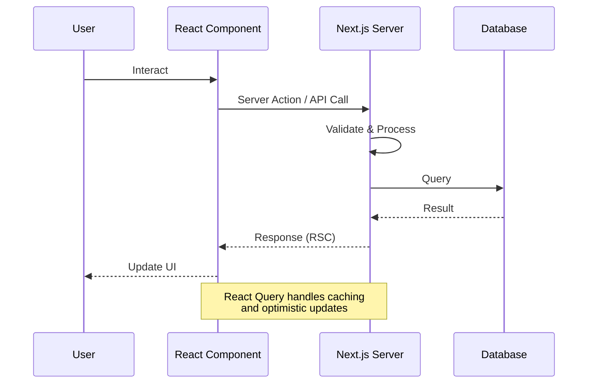

# Data Flow

```mermaid
sequenceDiagram
    participant User
    participant UI as React Component
    participant Server as Next.js Server
    participant DB as Database

    User->>UI: Interact
    UI->>Server: Server Action / API Call
    Server->>Server: Validate & Process
    Server->>DB: Query
    DB-->>Server: Result
    Server-->>UI: Response (RSC)
    UI-->>User: Update UI

    Note over UI,Server: React Query handles caching<br/>and optimistic updates
```
