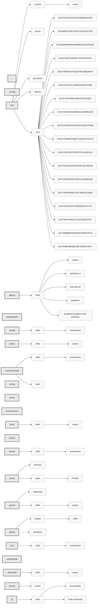

# Project Structure

```mermaid
flowchart LR
    dir0["."]
    style dir0 fill:#e8e8e8,stroke:#333,stroke-width:2px
    dir1["_scripts"]
    style dir1 fill:#e8e8e8,stroke:#333,stroke-width:2px
    dir2[".a5c"]
    style dir2 fill:#e8e8e8,stroke:#333,stroke-width:2px
    dir3[".pi-lens"]
    style dir3 fill:#f8f8f8,stroke:#999
    dir4["cache"]
    style dir4 fill:#f8f8f8,stroke:#999
    dir5["inputs"]
    style dir5 fill:#f8f8f8,stroke:#999
    dir6["processes"]
    style dir6 fill:#f8f8f8,stroke:#999
    dir7["reports"]
    style dir7 fill:#f8f8f8,stroke:#999
    dir8["runs"]
    style dir8 fill:#f8f8f8,stroke:#999
    dir9["01KST5PQS4Z31C021MM85Q4XWE"]
    style dir9 fill:#f8f8f8,stroke:#999
    dir10["01KSWBSCEWV7E6JY2HA2AJZ7GK"]
    style dir10 fill:#f8f8f8,stroke:#999
    dir11["01KSWWRW9WM3AM0BDZN2NZX4W0"]
    style dir11 fill:#f8f8f8,stroke:#999
    dir12["01KSY9AZTV6025FYM4XJG55A2V"]
    style dir12 fill:#f8f8f8,stroke:#999
    dir13["01KSY9BWKW7M2Z2HMX53BQ82HV"]
    style dir13 fill:#f8f8f8,stroke:#999
    dir14["01KSY9CQTJCZZB0N2WJ8VXX8D5"]
    style dir14 fill:#f8f8f8,stroke:#999
    dir15["01KSY9CXR0QT094FJT8T182923"]
    style dir15 fill:#f8f8f8,stroke:#999
    dir16["01KSYGKFEEWSRBK5GATBMBC209"]
    style dir16 fill:#f8f8f8,stroke:#999
    dir17["01KSYKWWWVZXADN2GZD9ZY9H85"]
    style dir17 fill:#f8f8f8,stroke:#999
    dir18["01KSYX4BWRC0QECVSQW57XGZTS"]
    style dir18 fill:#f8f8f8,stroke:#999
    dir19["01KSYX8PHZCF5WFPPG1AH2H313"]
    style dir19 fill:#f8f8f8,stroke:#999
    dir20["01KT1W1EXSFWY6DJ3R2JE7MCMS"]
    style dir20 fill:#f8f8f8,stroke:#999
    dir21["01KT1W36FGPQYP96XZ16QJB3WQ"]
    style dir21 fill:#f8f8f8,stroke:#999
    dir22["01KT1W3FRB6RV192YWRE3E34QE"]
    style dir22 fill:#f8f8f8,stroke:#999
    dir23["01KT3AEF65XD7R055ESFVZFTT9"]
    style dir23 fill:#f8f8f8,stroke:#999
    dir24["01KT3AF0VB01Z173JFD36ECDVH"]
    style dir24 fill:#f8f8f8,stroke:#999
    dir25["01KT8988B5WNF8M2KC9SMY0F04"]
    style dir25 fill:#f8f8f8,stroke:#999
    dir26["01KTAWBP8B38HH3ETN02D7GBY7"]
    style dir26 fill:#f8f8f8,stroke:#999
    dir27[".agents"]
    style dir27 fill:#e8e8e8,stroke:#333,stroke-width:2px
    dir28["skills"]
    style dir28 fill:#f8f8f8,stroke:#999
    dir29["expect"]
    style dir29 fill:#f8f8f8,stroke:#999
    dir30["optimistic-ui"]
    style dir30 fill:#f8f8f8,stroke:#999
    dir31["react-doctor"]
    style dir31 fill:#f8f8f8,stroke:#999
    dir32["supabase"]
    style dir32 fill:#f8f8f8,stroke:#999
    dir33["supabase-postgres-best-practices"]
    style dir33 fill:#f8f8f8,stroke:#999
    dir34[".antigravitycli"]
    style dir34 fill:#e8e8e8,stroke:#333,stroke-width:2px
    dir35[".claude"]
    style dir35 fill:#e8e8e8,stroke:#333,stroke-width:2px
    dir36["skills"]
    style dir36 fill:#f8f8f8,stroke:#999
    dir37["react-doctor"]
    style dir37 fill:#f8f8f8,stroke:#999
    dir38[".codex"]
    style dir38 fill:#e8e8e8,stroke:#333,stroke-width:2px
    dir39["skills"]
    style dir39 fill:#f8f8f8,stroke:#999
    dir40["expect"]
    style dir40 fill:#f8f8f8,stroke:#999
    dir41[".commandcode"]
    style dir41 fill:#e8e8e8,stroke:#333,stroke-width:2px
    dir42["skills"]
    style dir42 fill:#f8f8f8,stroke:#999
    dir43["react-doctor"]
    style dir43 fill:#f8f8f8,stroke:#999
    dir44["taste"]
    style dir44 fill:#f8f8f8,stroke:#999
    dir45[".config"]
    style dir45 fill:#e8e8e8,stroke:#333,stroke-width:2px
    dir46[".cursor"]
    style dir46 fill:#e8e8e8,stroke:#333,stroke-width:2px
    dir47[".documentizer"]
    style dir47 fill:#e8e8e8,stroke:#333,stroke-width:2px
    dir48[".droid"]
    style dir48 fill:#e8e8e8,stroke:#333,stroke-width:2px
    dir49["skills"]
    style dir49 fill:#f8f8f8,stroke:#999
    dir50["expect"]
    style dir50 fill:#f8f8f8,stroke:#999
    dir51[".expect"]
    style dir51 fill:#e8e8e8,stroke:#333,stroke-width:2px
    dir52[".factory"]
    style dir52 fill:#e8e8e8,stroke:#333,stroke-width:2px
    dir53["skills"]
    style dir53 fill:#f8f8f8,stroke:#999
    dir54["react-doctor"]
    style dir54 fill:#f8f8f8,stroke:#999
    dir55[".fusion"]
    style dir55 fill:#e8e8e8,stroke:#333,stroke-width:2px
    dir56["memory"]
    style dir56 fill:#f8f8f8,stroke:#999
    dir57["tasks"]
    style dir57 fill:#f8f8f8,stroke:#999
    dir58["FN-001"]
    style dir58 fill:#f8f8f8,stroke:#999
    dir59[".gemini"]
    style dir59 fill:#e8e8e8,stroke:#333,stroke-width:2px
    dir60["antigravity"]
    style dir60 fill:#f8f8f8,stroke:#999
    dir61["skills"]
    style dir61 fill:#f8f8f8,stroke:#999
    dir62["expect"]
    style dir62 fill:#f8f8f8,stroke:#999
    dir63[".github"]
    style dir63 fill:#e8e8e8,stroke:#333,stroke-width:2px
    dir64["copilot"]
    style dir64 fill:#f8f8f8,stroke:#999
    dir65["skills"]
    style dir65 fill:#f8f8f8,stroke:#999
    dir66["workflows"]
    style dir66 fill:#f8f8f8,stroke:#999
    dir67[".kiro"]
    style dir67 fill:#e8e8e8,stroke:#333,stroke-width:2px
    dir68["skills"]
    style dir68 fill:#f8f8f8,stroke:#999
    dir69["react-doctor"]
    style dir69 fill:#f8f8f8,stroke:#999
    dir70[".openclaude"]
    style dir70 fill:#e8e8e8,stroke:#333,stroke-width:2px
    dir71[".opencode"]
    style dir71 fill:#e8e8e8,stroke:#333,stroke-width:2px
    dir72["skills"]
    style dir72 fill:#f8f8f8,stroke:#999
    dir73["expect"]
    style dir73 fill:#f8f8f8,stroke:#999
    dir74[".pi"]
    style dir74 fill:#e8e8e8,stroke:#333,stroke-width:2px
    dir75[".pi-lens"]
    style dir75 fill:#e8e8e8,stroke:#333,stroke-width:2px
    dir76["cache"]
    style dir76 fill:#f8f8f8,stroke:#999
    dir77["skills"]
    style dir77 fill:#f8f8f8,stroke:#999
    dir78["accessibility"]
    style dir78 fill:#f8f8f8,stroke:#999
    dir79["code-standards"]
    style dir79 fill:#f8f8f8,stroke:#999
    dir2 --> dir3
    dir3 --> dir4
    dir2 --> dir5
    dir2 --> dir6
    dir2 --> dir7
    dir2 --> dir8
    dir8 --> dir9
    dir8 --> dir10
    dir8 --> dir11
    dir8 --> dir12
    dir8 --> dir13
    dir8 --> dir14
    dir8 --> dir15
    dir8 --> dir16
    dir8 --> dir17
    dir8 --> dir18
    dir8 --> dir19
    dir8 --> dir20
    dir8 --> dir21
    dir8 --> dir22
    dir8 --> dir23
    dir8 --> dir24
    dir8 --> dir25
    dir8 --> dir26
    dir27 --> dir28
    dir28 --> dir29
    dir28 --> dir30
    dir28 --> dir31
    dir28 --> dir32
    dir28 --> dir33
    dir35 --> dir36
    dir36 --> dir37
    dir38 --> dir39
    dir39 --> dir40
    dir41 --> dir42
    dir42 --> dir43
    dir41 --> dir44
    dir48 --> dir49
    dir49 --> dir50
    dir52 --> dir53
    dir53 --> dir54
    dir55 --> dir56
    dir55 --> dir57
    dir57 --> dir58
    dir59 --> dir60
    dir59 --> dir61
    dir61 --> dir62
    dir63 --> dir64
    dir64 --> dir65
    dir63 --> dir66
    dir67 --> dir68
    dir68 --> dir69
    dir71 --> dir72
    dir72 --> dir73
    dir75 --> dir76
    dir74 --> dir77
    dir77 --> dir78
    dir77 --> dir79
```
