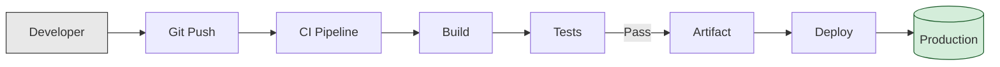

# Deployment

```mermaid
flowchart LR
    Dev["Developer"] --> Git["Git Push"]
    Git --> CI["CI Pipeline"]
    CI --> Build["Build"]
    Build --> Test["Tests"]
    Test -->|Pass| Artifact["Artifact"]
    Artifact --> Deploy["Deploy"]
    Deploy --> Prod[("Production")]

    style Dev fill:#e8e8e8,stroke:#333
    style Prod fill:#d4edda,stroke:#155724
```
