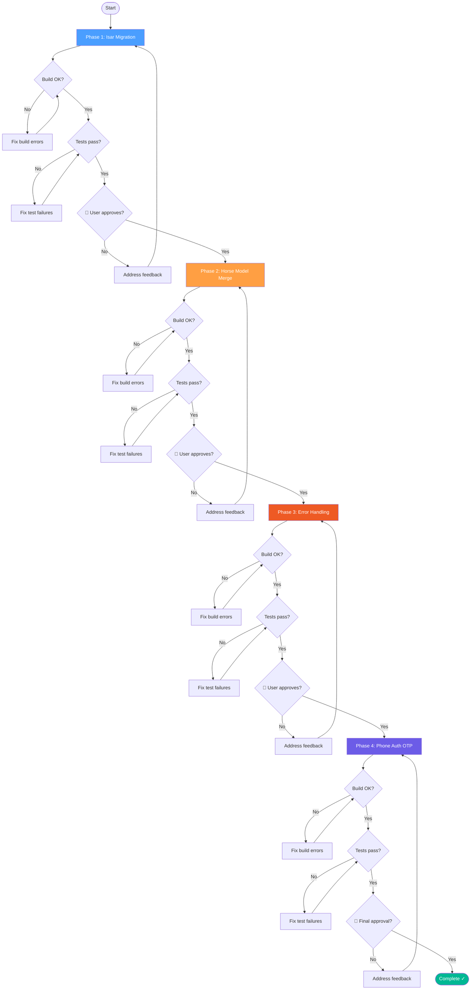

# Tamga Phase 1 — Process Flow

```mermaid
graph TD
    Start([Start]) --> P1[Phase 1: Isar Migration]
    P1 --> P1Build{Build OK?}
    P1Build -->|No| P1Fix[Fix build errors]
    P1Fix --> P1Build
    P1Build -->|Yes| P1Test{Tests pass?}
    P1Test -->|No| P1FixTest[Fix test failures]
    P1FixTest --> P1Test
    P1Test -->|Yes| P1Gate{👤 User approves?}
    P1Gate -->|No| P1Feedback[Address feedback]
    P1Feedback --> P1
    P1Gate -->|Yes| P2[Phase 2: Horse Model Merge]
    
    P2 --> P2Build{Build OK?}
    P2Build -->|No| P2Fix[Fix build errors]
    P2Fix --> P2Build
    P2Build -->|Yes| P2Test{Tests pass?}
    P2Test -->|No| P2FixTest[Fix test failures]
    P2FixTest --> P2Test
    P2Test -->|Yes| P2Gate{👤 User approves?}
    P2Gate -->|No| P2Feedback[Address feedback]
    P2Feedback --> P2
    P2Gate -->|Yes| P3[Phase 3: Error Handling]
    
    P3 --> P3Build{Build OK?}
    P3Build -->|No| P3Fix[Fix build errors]
    P3Fix --> P3Build
    P3Build -->|Yes| P3Test{Tests pass?}
    P3Test -->|No| P3FixTest[Fix test failures]
    P3FixTest --> P3Test
    P3Test -->|Yes| P3Gate{👤 User approves?}
    P3Gate -->|No| P3Feedback[Address feedback]
    P3Feedback --> P3
    P3Gate -->|Yes| P4[Phase 4: Phone Auth OTP]
    
    P4 --> P4Build{Build OK?}
    P4Build -->|No| P4Fix[Fix build errors]
    P4Fix --> P4Build
    P4Build -->|Yes| P4Test{Tests pass?}
    P4Test -->|No| P4FixTest[Fix test failures]
    P4FixTest --> P4Test
    P4Test -->|Yes| P4Gate{👤 Final approval?}
    P4Gate -->|No| P4Feedback[Address feedback]
    P4Feedback --> P4
    P4Gate -->|Yes| Done([Complete ✓])
    
    style P1 fill:#4a9eff,color:#fff
    style P2 fill:#ff9f43,color:#fff
    style P3 fill:#ee5a24,color:#fff
    style P4 fill:#6c5ce7,color:#fff
    style Done fill:#00b894,color:#fff
```
