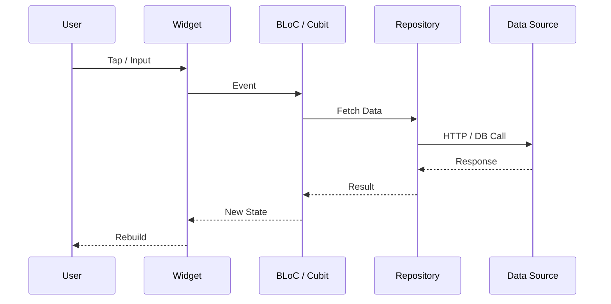

# Data Flow

```mermaid
sequenceDiagram
    participant User
    participant UI as Widget
    participant BLoC as BLoC / Cubit
    participant Repo as Repository
    participant API as Data Source

    User->>UI: Tap / Input
    UI->>BLoC: Event
    BLoC->>Repo: Fetch Data
    Repo->>API: HTTP / DB Call
    API-->>Repo: Response
    Repo-->>BLoC: Result
    BLoC-->>UI: New State
    UI-->>User: Rebuild
```
