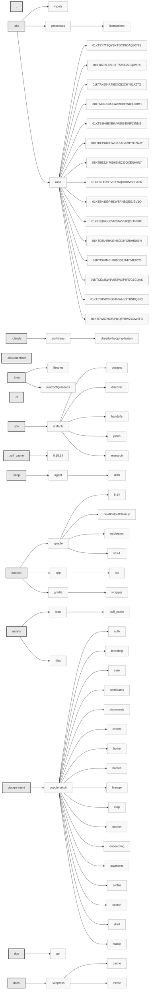

# Project Structure

```mermaid
flowchart LR
    dir0["."]
    style dir0 fill:#e8e8e8,stroke:#333,stroke-width:2px
    dir1[".a5c"]
    style dir1 fill:#e8e8e8,stroke:#333,stroke-width:2px
    dir2["inputs"]
    style dir2 fill:#f8f8f8,stroke:#999
    dir3["processes"]
    style dir3 fill:#f8f8f8,stroke:#999
    dir4["instructions"]
    style dir4 fill:#f8f8f8,stroke:#999
    dir5["runs"]
    style dir5 fill:#f8f8f8,stroke:#999
    dir6["01KT8Y7T9QYBKTGCD90AQ5079S"]
    style dir6 fill:#f8f8f8,stroke:#999
    dir7["01KT8Z39J0V1JFTSV3G5CQXV7X"]
    style dir7 fill:#f8f8f8,stroke:#999
    dir8["01KTAX604A79DXCB2CHY8JAZ7Q"]
    style dir8 fill:#f8f8f8,stroke:#999
    dir9["01KTAX6DBMJCW89R95W08RJ0M1"]
    style dir9 fill:#f8f8f8,stroke:#999
    dir10["01KTB8H6BXB6VMS0635NFJ3NMZ"]
    style dir10 fill:#f8f8f8,stroke:#999
    dir11["01KTBEPK88DWDXZAGXMPYHZNJY"]
    style dir11 fill:#f8f8f8,stroke:#999
    dir12["01KTBES2470D6ZMQ23QXENH0N7"]
    style dir12 fill:#f8f8f8,stroke:#999
    dir13["01KTBETN6HVPX76Q3CGM5CG42N"]
    style dir13 fill:#f8f8f8,stroke:#999
    dir14["01KTBN159P8B3V5RNBQESJBV1Q"]
    style dir14 fill:#f8f8f8,stroke:#999
    dir15["01KTBQGGDJVP28WV59Q2ETP8KC"]
    style dir15 fill:#f8f8f8,stroke:#999
    dir16["01KTC5N4RH37HS0DJYXR0HD6ZH"]
    style dir16 fill:#f8f8f8,stroke:#999
    dir17["01KTC6HMEH788D58JT4734E9CC"]
    style dir17 fill:#f8f8f8,stroke:#999
    dir18["01KTCDMSW1V665WXP8R7G1CQAS"]
    style dir18 fill:#f8f8f8,stroke:#999
    dir19["01KTCDPWC4G6TNWHE9TRSDQBR3"]
    style dir19 fill:#f8f8f8,stroke:#999
    dir20["01KTRW5ZHCHJH1QERRVZC3W0F3"]
    style dir20 fill:#f8f8f8,stroke:#999
    dir21[".claude"]
    style dir21 fill:#e8e8e8,stroke:#333,stroke-width:2px
    dir22["worktrees"]
    style dir22 fill:#f8f8f8,stroke:#999
    dir23["cheerful-booping-lantern"]
    style dir23 fill:#f8f8f8,stroke:#999
    dir24[".documentizer"]
    style dir24 fill:#e8e8e8,stroke:#333,stroke-width:2px
    dir25[".idea"]
    style dir25 fill:#e8e8e8,stroke:#333,stroke-width:2px
    dir26["libraries"]
    style dir26 fill:#f8f8f8,stroke:#999
    dir27["runConfigurations"]
    style dir27 fill:#f8f8f8,stroke:#999
    dir28[".pi"]
    style dir28 fill:#e8e8e8,stroke:#333,stroke-width:2px
    dir29[".rpiv"]
    style dir29 fill:#e8e8e8,stroke:#333,stroke-width:2px
    dir30["artifacts"]
    style dir30 fill:#f8f8f8,stroke:#999
    dir31["designs"]
    style dir31 fill:#f8f8f8,stroke:#999
    dir32["discover"]
    style dir32 fill:#f8f8f8,stroke:#999
    dir33["handoffs"]
    style dir33 fill:#f8f8f8,stroke:#999
    dir34["plans"]
    style dir34 fill:#f8f8f8,stroke:#999
    dir35["research"]
    style dir35 fill:#f8f8f8,stroke:#999
    dir36[".ruff_cache"]
    style dir36 fill:#e8e8e8,stroke:#333,stroke-width:2px
    dir37["0.15.14"]
    style dir37 fill:#f8f8f8,stroke:#999
    dir38[".senpi"]
    style dir38 fill:#e8e8e8,stroke:#333,stroke-width:2px
    dir39["agent"]
    style dir39 fill:#f8f8f8,stroke:#999
    dir40["skills"]
    style dir40 fill:#f8f8f8,stroke:#999
    dir41["android"]
    style dir41 fill:#e8e8e8,stroke:#333,stroke-width:2px
    dir42[".gradle"]
    style dir42 fill:#f8f8f8,stroke:#999
    dir43["8.14"]
    style dir43 fill:#f8f8f8,stroke:#999
    dir44["buildOutputCleanup"]
    style dir44 fill:#f8f8f8,stroke:#999
    dir45["noVersion"]
    style dir45 fill:#f8f8f8,stroke:#999
    dir46["vcs-1"]
    style dir46 fill:#f8f8f8,stroke:#999
    dir47["app"]
    style dir47 fill:#f8f8f8,stroke:#999
    dir48["src"]
    style dir48 fill:#f8f8f8,stroke:#999
    dir49["gradle"]
    style dir49 fill:#f8f8f8,stroke:#999
    dir50["wrapper"]
    style dir50 fill:#f8f8f8,stroke:#999
    dir51["assets"]
    style dir51 fill:#e8e8e8,stroke:#333,stroke-width:2px
    dir52["icon"]
    style dir52 fill:#f8f8f8,stroke:#999
    dir53[".ruff_cache"]
    style dir53 fill:#f8f8f8,stroke:#999
    dir54["tiles"]
    style dir54 fill:#f8f8f8,stroke:#999
    dir55["design-intent"]
    style dir55 fill:#e8e8e8,stroke:#333,stroke-width:2px
    dir56["google-stitch"]
    style dir56 fill:#f8f8f8,stroke:#999
    dir57["auth"]
    style dir57 fill:#f8f8f8,stroke:#999
    dir58["breeding"]
    style dir58 fill:#f8f8f8,stroke:#999
    dir59["care"]
    style dir59 fill:#f8f8f8,stroke:#999
    dir60["certificates"]
    style dir60 fill:#f8f8f8,stroke:#999
    dir61["documents"]
    style dir61 fill:#f8f8f8,stroke:#999
    dir62["events"]
    style dir62 fill:#f8f8f8,stroke:#999
    dir63["home"]
    style dir63 fill:#f8f8f8,stroke:#999
    dir64["horses"]
    style dir64 fill:#f8f8f8,stroke:#999
    dir65["lineage"]
    style dir65 fill:#f8f8f8,stroke:#999
    dir66["map"]
    style dir66 fill:#f8f8f8,stroke:#999
    dir67["market"]
    style dir67 fill:#f8f8f8,stroke:#999
    dir68["onboarding"]
    style dir68 fill:#f8f8f8,stroke:#999
    dir69["payments"]
    style dir69 fill:#f8f8f8,stroke:#999
    dir70["profile"]
    style dir70 fill:#f8f8f8,stroke:#999
    dir71["search"]
    style dir71 fill:#f8f8f8,stroke:#999
    dir72["shell"]
    style dir72 fill:#f8f8f8,stroke:#999
    dir73["stable"]
    style dir73 fill:#f8f8f8,stroke:#999
    dir74["doc"]
    style dir74 fill:#e8e8e8,stroke:#333,stroke-width:2px
    dir75["api"]
    style dir75 fill:#f8f8f8,stroke:#999
    dir76["docs"]
    style dir76 fill:#e8e8e8,stroke:#333,stroke-width:2px
    dir77[".vitepress"]
    style dir77 fill:#f8f8f8,stroke:#999
    dir78["cache"]
    style dir78 fill:#f8f8f8,stroke:#999
    dir79["theme"]
    style dir79 fill:#f8f8f8,stroke:#999
    dir1 --> dir2
    dir1 --> dir3
    dir3 --> dir4
    dir1 --> dir5
    dir5 --> dir6
    dir5 --> dir7
    dir5 --> dir8
    dir5 --> dir9
    dir5 --> dir10
    dir5 --> dir11
    dir5 --> dir12
    dir5 --> dir13
    dir5 --> dir14
    dir5 --> dir15
    dir5 --> dir16
    dir5 --> dir17
    dir5 --> dir18
    dir5 --> dir19
    dir5 --> dir20
    dir21 --> dir22
    dir22 --> dir23
    dir25 --> dir26
    dir25 --> dir27
    dir29 --> dir30
    dir30 --> dir31
    dir30 --> dir32
    dir30 --> dir33
    dir30 --> dir34
    dir30 --> dir35
    dir36 --> dir37
    dir38 --> dir39
    dir39 --> dir40
    dir41 --> dir42
    dir42 --> dir43
    dir42 --> dir44
    dir42 --> dir45
    dir42 --> dir46
    dir41 --> dir47
    dir47 --> dir48
    dir41 --> dir49
    dir49 --> dir50
    dir51 --> dir52
    dir52 --> dir53
    dir51 --> dir54
    dir55 --> dir56
    dir56 --> dir57
    dir56 --> dir58
    dir56 --> dir59
    dir56 --> dir60
    dir56 --> dir61
    dir56 --> dir62
    dir56 --> dir63
    dir56 --> dir64
    dir56 --> dir65
    dir56 --> dir66
    dir56 --> dir67
    dir56 --> dir68
    dir56 --> dir69
    dir56 --> dir70
    dir56 --> dir71
    dir56 --> dir72
    dir56 --> dir73
    dir74 --> dir75
    dir76 --> dir77
    dir77 --> dir78
    dir77 --> dir79
```
