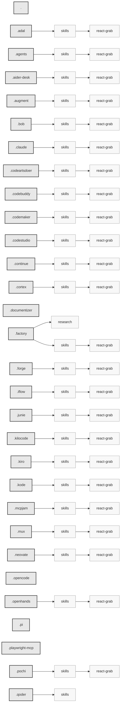

# Project Structure

```mermaid
flowchart LR
    dir0["."]
    style dir0 fill:#e8e8e8,stroke:#333,stroke-width:2px
    dir1[".adal"]
    style dir1 fill:#e8e8e8,stroke:#333,stroke-width:2px
    dir2["skills"]
    style dir2 fill:#f8f8f8,stroke:#999
    dir3["react-grab"]
    style dir3 fill:#f8f8f8,stroke:#999
    dir4[".agents"]
    style dir4 fill:#e8e8e8,stroke:#333,stroke-width:2px
    dir5["skills"]
    style dir5 fill:#f8f8f8,stroke:#999
    dir6["react-grab"]
    style dir6 fill:#f8f8f8,stroke:#999
    dir7[".aider-desk"]
    style dir7 fill:#e8e8e8,stroke:#333,stroke-width:2px
    dir8["skills"]
    style dir8 fill:#f8f8f8,stroke:#999
    dir9["react-grab"]
    style dir9 fill:#f8f8f8,stroke:#999
    dir10[".augment"]
    style dir10 fill:#e8e8e8,stroke:#333,stroke-width:2px
    dir11["skills"]
    style dir11 fill:#f8f8f8,stroke:#999
    dir12["react-grab"]
    style dir12 fill:#f8f8f8,stroke:#999
    dir13[".bob"]
    style dir13 fill:#e8e8e8,stroke:#333,stroke-width:2px
    dir14["skills"]
    style dir14 fill:#f8f8f8,stroke:#999
    dir15["react-grab"]
    style dir15 fill:#f8f8f8,stroke:#999
    dir16[".claude"]
    style dir16 fill:#e8e8e8,stroke:#333,stroke-width:2px
    dir17["skills"]
    style dir17 fill:#f8f8f8,stroke:#999
    dir18["react-grab"]
    style dir18 fill:#f8f8f8,stroke:#999
    dir19[".codeartsdoer"]
    style dir19 fill:#e8e8e8,stroke:#333,stroke-width:2px
    dir20["skills"]
    style dir20 fill:#f8f8f8,stroke:#999
    dir21["react-grab"]
    style dir21 fill:#f8f8f8,stroke:#999
    dir22[".codebuddy"]
    style dir22 fill:#e8e8e8,stroke:#333,stroke-width:2px
    dir23["skills"]
    style dir23 fill:#f8f8f8,stroke:#999
    dir24["react-grab"]
    style dir24 fill:#f8f8f8,stroke:#999
    dir25[".codemaker"]
    style dir25 fill:#e8e8e8,stroke:#333,stroke-width:2px
    dir26["skills"]
    style dir26 fill:#f8f8f8,stroke:#999
    dir27["react-grab"]
    style dir27 fill:#f8f8f8,stroke:#999
    dir28[".codestudio"]
    style dir28 fill:#e8e8e8,stroke:#333,stroke-width:2px
    dir29["skills"]
    style dir29 fill:#f8f8f8,stroke:#999
    dir30["react-grab"]
    style dir30 fill:#f8f8f8,stroke:#999
    dir31[".continue"]
    style dir31 fill:#e8e8e8,stroke:#333,stroke-width:2px
    dir32["skills"]
    style dir32 fill:#f8f8f8,stroke:#999
    dir33["react-grab"]
    style dir33 fill:#f8f8f8,stroke:#999
    dir34[".cortex"]
    style dir34 fill:#e8e8e8,stroke:#333,stroke-width:2px
    dir35["skills"]
    style dir35 fill:#f8f8f8,stroke:#999
    dir36["react-grab"]
    style dir36 fill:#f8f8f8,stroke:#999
    dir37[".documentizer"]
    style dir37 fill:#e8e8e8,stroke:#333,stroke-width:2px
    dir38[".factory"]
    style dir38 fill:#e8e8e8,stroke:#333,stroke-width:2px
    dir39["research"]
    style dir39 fill:#f8f8f8,stroke:#999
    dir40["skills"]
    style dir40 fill:#f8f8f8,stroke:#999
    dir41["react-grab"]
    style dir41 fill:#f8f8f8,stroke:#999
    dir42[".forge"]
    style dir42 fill:#e8e8e8,stroke:#333,stroke-width:2px
    dir43["skills"]
    style dir43 fill:#f8f8f8,stroke:#999
    dir44["react-grab"]
    style dir44 fill:#f8f8f8,stroke:#999
    dir45[".iflow"]
    style dir45 fill:#e8e8e8,stroke:#333,stroke-width:2px
    dir46["skills"]
    style dir46 fill:#f8f8f8,stroke:#999
    dir47["react-grab"]
    style dir47 fill:#f8f8f8,stroke:#999
    dir48[".junie"]
    style dir48 fill:#e8e8e8,stroke:#333,stroke-width:2px
    dir49["skills"]
    style dir49 fill:#f8f8f8,stroke:#999
    dir50["react-grab"]
    style dir50 fill:#f8f8f8,stroke:#999
    dir51[".kilocode"]
    style dir51 fill:#e8e8e8,stroke:#333,stroke-width:2px
    dir52["skills"]
    style dir52 fill:#f8f8f8,stroke:#999
    dir53["react-grab"]
    style dir53 fill:#f8f8f8,stroke:#999
    dir54[".kiro"]
    style dir54 fill:#e8e8e8,stroke:#333,stroke-width:2px
    dir55["skills"]
    style dir55 fill:#f8f8f8,stroke:#999
    dir56["react-grab"]
    style dir56 fill:#f8f8f8,stroke:#999
    dir57[".kode"]
    style dir57 fill:#e8e8e8,stroke:#333,stroke-width:2px
    dir58["skills"]
    style dir58 fill:#f8f8f8,stroke:#999
    dir59["react-grab"]
    style dir59 fill:#f8f8f8,stroke:#999
    dir60[".mcpjam"]
    style dir60 fill:#e8e8e8,stroke:#333,stroke-width:2px
    dir61["skills"]
    style dir61 fill:#f8f8f8,stroke:#999
    dir62["react-grab"]
    style dir62 fill:#f8f8f8,stroke:#999
    dir63[".mux"]
    style dir63 fill:#e8e8e8,stroke:#333,stroke-width:2px
    dir64["skills"]
    style dir64 fill:#f8f8f8,stroke:#999
    dir65["react-grab"]
    style dir65 fill:#f8f8f8,stroke:#999
    dir66[".neovate"]
    style dir66 fill:#e8e8e8,stroke:#333,stroke-width:2px
    dir67["skills"]
    style dir67 fill:#f8f8f8,stroke:#999
    dir68["react-grab"]
    style dir68 fill:#f8f8f8,stroke:#999
    dir69[".opencode"]
    style dir69 fill:#e8e8e8,stroke:#333,stroke-width:2px
    dir70[".openhands"]
    style dir70 fill:#e8e8e8,stroke:#333,stroke-width:2px
    dir71["skills"]
    style dir71 fill:#f8f8f8,stroke:#999
    dir72["react-grab"]
    style dir72 fill:#f8f8f8,stroke:#999
    dir73[".pi"]
    style dir73 fill:#e8e8e8,stroke:#333,stroke-width:2px
    dir74[".playwright-mcp"]
    style dir74 fill:#e8e8e8,stroke:#333,stroke-width:2px
    dir75[".pochi"]
    style dir75 fill:#e8e8e8,stroke:#333,stroke-width:2px
    dir76["skills"]
    style dir76 fill:#f8f8f8,stroke:#999
    dir77["react-grab"]
    style dir77 fill:#f8f8f8,stroke:#999
    dir78[".qoder"]
    style dir78 fill:#e8e8e8,stroke:#333,stroke-width:2px
    dir79["skills"]
    style dir79 fill:#f8f8f8,stroke:#999
    dir1 --> dir2
    dir2 --> dir3
    dir4 --> dir5
    dir5 --> dir6
    dir7 --> dir8
    dir8 --> dir9
    dir10 --> dir11
    dir11 --> dir12
    dir13 --> dir14
    dir14 --> dir15
    dir16 --> dir17
    dir17 --> dir18
    dir19 --> dir20
    dir20 --> dir21
    dir22 --> dir23
    dir23 --> dir24
    dir25 --> dir26
    dir26 --> dir27
    dir28 --> dir29
    dir29 --> dir30
    dir31 --> dir32
    dir32 --> dir33
    dir34 --> dir35
    dir35 --> dir36
    dir38 --> dir39
    dir38 --> dir40
    dir40 --> dir41
    dir42 --> dir43
    dir43 --> dir44
    dir45 --> dir46
    dir46 --> dir47
    dir48 --> dir49
    dir49 --> dir50
    dir51 --> dir52
    dir52 --> dir53
    dir54 --> dir55
    dir55 --> dir56
    dir57 --> dir58
    dir58 --> dir59
    dir60 --> dir61
    dir61 --> dir62
    dir63 --> dir64
    dir64 --> dir65
    dir66 --> dir67
    dir67 --> dir68
    dir70 --> dir71
    dir71 --> dir72
    dir75 --> dir76
    dir76 --> dir77
    dir78 --> dir79
```
